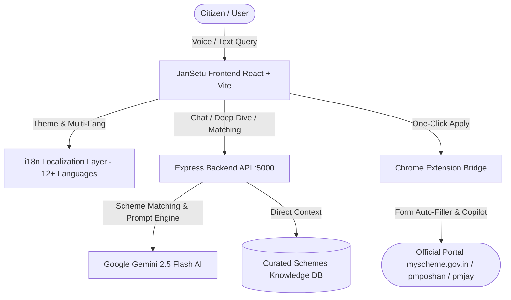

# 🇮🇳 JanSetu (जन-सेतु) — AI-Powered Citizen Welfare Discovery & Fulfillment Platform

> **Hackathon Pitch & Project Presentation Dossier**  
> *Transforming Government Scheme Discovery, AI Eligibility Verification, and Last-Mile Form Automation for 1.4+ Billion Citizens.*

---

## 📌 1. Executive Summary & Elevator Pitch

### The 30-Second Elevator Pitch
> *"Over ₹3 Lakh Crore in government welfare benefits go unclaimed every year because citizens don’t know what they qualify for, can’t decipher bureaucratic language, or struggle with complex application forms. **JanSetu** is India's first AI-driven welfare copilot that uses **Multimodal Gemini AI**, **Vernacular Voice Interaction**, **Real-Time Eligibility Matching**, and a **Browser Copilot Extension** to guide any citizen—from a rural farmer to an urban gig worker—from scheme discovery to final application submission in under 3 minutes."*

---

## 🎯 2. The Problem: The "Last-Mile Delivery" Crisis

Despite thousands of Central and State government schemes in India (PM-JAY, PM-Kisan, PMAY, APY, PM Vishwakarma, etc.), citizens face severe friction:

| Friction Point | Reality on the Ground | Impact |
| :--- | :--- | :--- |
| **Information Asymmetry** | Welfare portals are fragmented across 50+ ministerial websites. | Citizens miss out on life-changing subsidies & healthcare. |
| **Language & Literacy Barrier** | Official guidelines are written in dense English/formal Hindi jargon. | Rural & semi-literate citizens depend on exploitative middlemen. |
| **Eligibility Confusion** | Schemes have intricate criteria (land holding, caste, income slab, age). | Citizens are rejected due to minor disqualifications. |
| **Application Fatigue** | Repetitive manual data entry across disparate state and central portals. | High form drop-off rates and incomplete submissions. |

---

## 💡 3. The Solution: JanSetu Ecosystem

JanSetu acts as a digital bridge (**सेतु**) connecting eligible citizens with entitlements through four integrated pillars:

```
                  ┌──────────────────────────────────────────────┐
                  │                 CITIZEN                      │
                  │   (Voice / Text / 12+ Indian Languages)      │
                  └──────────────────────┬───────────────────────┘
                                         │
                                         ▼
   ┌────────────────────────────────────────────────────────────────────────────┐
   │                            JANSETU WEB APP                                 │
   │  ┌─────────────────────────┐  ┌──────────────────┐  ┌───────────────────┐  │
   │  │ Conversational AI Agent │  │ Smart Schemes    │  │ Citizen Profile & │  │
   │  │ (Gemini 2.5 Flash + TTS)│  │ Directory & Recs │  │ Eligibility Engine│  │
   │  └─────────────────────────┘  └──────────────────┘  └───────────────────┘  │
   └──────────────────────┬───────────────────────────────┬─────────────────────┘
                          │                               │
                          ▼                               ▼
       ┌─────────────────────────────────────┐  ┌───────────────────────────────┐
       │     JANSETU BACKEND & AI ENGINE     │  │   JANSETU CHROME EXTENSION    │
       │ • Gemini Multilingual Reasoning     │  │ • Official Portal Assistant   │
       │ • Scheme Vector & Knowledge Base    │  │ • One-Click Form Auto-Filler  │
       │ • Demographic Match Calculator      │  │ • Real-Time Field Validator   │
       └─────────────────────────────────────┘  └───────────────────────────────┘
```

---

## 🏗️ 4. System Architecture & Technical Stack

### Tech Stack Matrix
- **Frontend**: React 18, Vite, Tailwind CSS, Lucide Icons, i18next (12+ languages support), HTML5 Web Speech API (Voice STT / TTS).
- **Theme & UX**: Site-wide Adaptive Dark / Light mode, high-contrast accessible design tokens, micro-animations.
- **Backend API**: Node.js, Express.js, RESTful micro-routes, CORS, JWT Authentication, in-memory state management with local persistence fallbacks.
- **AI & Intelligence**: Google Gemini API (`gemini-2.5-flash` with graceful fallback to `gemini-2.5-flash-lite`), Dynamic Few-Shot Prompting, Strict JSON Schemas.
- **Extension**: Chrome Extension (Manifest V3), Content Script Form Injector, Real-Time Cross-Origin Message Passing (`chrome.runtime`).

### Component Architecture Diagram


---

## ✨ 5. Key Features Implemented & Working Today

### 1. Conversational AI Welfare Copilot (`/assistant`)
- **Conversational Scheme Finder**: Ask in colloquial Hindi, Hinglish, English, or regional languages (*e.g., "Main MP mein kisan hoon, mujhe tractor subsidy chahiye"*).
- **Dynamic Action Cards**: Instant recommendation cards with match percentages, benefits breakdown, and one-click deep dives.
- **Integrated Voice Assistant**: Hands-free voice speech-to-text input and natural text-to-speech voice playback.
- **Interactive Suggestions**: Quick prompt chips for agriculture, healthcare, student scholarships, women empowerment, and senior pensions.

### 2. Intelligent Citizen Demographic Profile & Matching (`/profile`)
- **Single Source of Truth**: Stores Age, Gender, State, Income Slab, Occupation, and Family demographics.
- **Automated Scheme Eligibility Engine**: Real-time evaluation against scheme criteria with exact match explanations (*"Matched based on 3-8L income bracket & Madhya Pradesh residence"*).
- **Bookmarked & Saved Schemes**: Quick bookmarking from chat, browse directory, or scheme details for future follow-up.
- **Profile Completeness Tracker**: Visual progress bar nudging citizens to provide full criteria for maximum scheme discovery.

### 3. Comprehensive Schemes Directory & Deep Dive (`/schemes`, `/schemes/:id`)
- **Multi-Filter Search**: Filter by Ministry, State, Category (Health, Agriculture, Social Security, Education, Housing, Business).
- **Deep Dive Modals**: Structured breakdowns of:
  - Official Scheme Overview & Ministry
  - Concrete Financial & Social Benefits
  - Clear Step-by-Step Qualification Criteria
  - Mandatory Documents Checklist (Aadhaar, Income Proof, Land Records, etc.)
  - Disqualification Exceptions

### 4. End-to-End Application Portal & Tracker (`/applications`, `/apply/:id`)
- **Simulated Form Builder**: Multi-step step-by-step application pipeline with pre-fill capability from citizen demographic profile.
- **Application Status Timeline**: Real-time tracking from *Submitted -> Under Review -> Verification -> Approved/Disbursed*.
- **Direct Portal Redirect**: Deep links to official government portals (`pmvishwakarma.gov.in`, `pmposhan.education.gov.in`, `myscheme.gov.in`).

### 5. Chrome Extension Form Copilot (`extension/`)
- **Manifest V3 Architecture**: Detects when a user visits official government portals.
- **Profile Auto-Fill Bridge**: Securely pulls citizen demographic data to pre-fill standard identity and financial form fields.
- **Real-Time Field Guidance**: Tooltips explaining what documents are needed for tricky government form inputs.

### 6. Accessibility & Vernacular Inclusivity
- **Multi-Language Architecture**: Full UI localization across Hindi, English, Bengali, Tamil, Telugu, Marathi, and more.
- **Site-Wide Dark Mode**: High-contrast, accessibility-focused color palette with persistent theme storage.
- **Mobile-Responsive**: Designed with touch-first ergonomics for low-cost Android smartphones.

---

## 🧠 6. AI & Engineering Innovations

### 1. Robust Fallback & Self-Healing Gemini Pipeline
```javascript
// backend/src/services/gemini.js
// Dual-model fallback hierarchy ensures zero downtime during hackathon demos
async function callGeminiWithFallback(prompt, systemInstruction) {
  try {
    return await gemini25Flash.generateContent(...);
  } catch (error) {
    console.warn("Primary model limit reached, falling back to Flash-Lite...");
    return await gemini25FlashLite.generateContent(...);
  }
}
```

### 2. Context-Aware Grounding Prompt
The AI prompt dynamically merges:
1. Citizen Profile context (State, Income, Profession).
2. Curated Scheme Knowledge Base.
3. Natural Language intent classification (handling misspellings, colloquial terms like *"fasal beema"*, *"kisan credit card"*).
4. Strict JSON structure output for deterministic UI rendering alongside conversational text.

---

## 📊 7. Competitive Advantage & Market Differentiation

| Feature / Metric | JanSetu | myScheme.gov.in | Umang App | Private Aggregators |
| :--- | :---: | :---: | :---: | :---: |
| **Conversational AI Guidance** | ✅ (Gemini 2.5) | ❌ Static Search | ❌ Keyword Only | ⚠️ Limited rule engine |
| **Voice Query & Vernacular TTS** | ✅ Real-Time | ❌ No | ⚠️ Basic Audio | ❌ No |
| **Dynamic Reason-Based Match** | ✅ (Why you qualify) | ⚠️ Complex Filter | ❌ Manual Search | ❌ No |
| **Browser Form Auto-Filler** | ✅ Dedicated Ext | ❌ No | ❌ No | ❌ No |
| **Deep-Dive Document Checklist** | ✅ Instant Modal | ⚠️ PDF Download | ⚠️ Dense Text | ⚠️ Paywalled |
| **Dark Mode & Modern UX** | ✅ Ultra-modern | ❌ Basic Web 1.0 | ❌ Outdated | ⚠️ Ad-Heavy |

---

## 🚀 8. Future Roadmap (What We'll Build Next)

```
  ┌─────────────────────────┐     ┌─────────────────────────┐     ┌─────────────────────────┐
  │         PHASE 1         │     │         PHASE 2         │     │         PHASE 3         │
  │    (Current MVP / Now)  │ ──► │     (Next 3 Months)     │ ──► │     (Scale & Impact)      │
  └─────────────────────────┘     └─────────────────────────┘     └─────────────────────────┘
   • Gemini AI Conversational      • WhatsApp & Telegram Bot       • DigiLocker API Integration
     Welfare Assistant               Channel for zero-install        for zero-upload document
   • Real-Time Profile Match       • Computer Vision OCR for         verification
   • Chrome Form Copilot             Instant Ration/Aadhaar Doc    • Gram Panchayat / CSC Kiosk
   • Multi-Language & Dark Theme     Verification                    Mode with offline sync
```

1. **DigiLocker Direct API**: Automatic document extraction (Aadhaar, Caste Certificate, Land Records) directly into the application pipeline.
2. **WhatsApp Bot via Twilio / Meta API**: Interacting via WhatsApp voice notes for citizens without laptop/web access.
3. **CSC (Common Service Center) Agent Mode**: Special dashboard for rural village entrepreneurs to onboard 100+ citizens simultaneously.
4. **State-Level Dynamic Web Scraper**: Automated daily ingest of new gazette notifications to keep scheme database 100% up to date.

---

## 🎤 9. Hackathon Presentation & Live Demo Guide (3-Minute Pitch)

### ⏱️ Minute 0:00 - 0:45 | The Hook & The Problem
> *"Namaste Judges. India has some of the world's most progressive welfare schemes, but over 60% of eligible citizens never benefit because of information fragmentation, English-centric portals, and bureaucratic hurdles. We built **JanSetu**—the intelligent AI bridge that makes welfare access as simple as talking to a friend."*

### ⏱️ Minute 0:45 - 1:45 | Live Demo Walkthrough
1. **Show Assistant (`/assistant`)**:
   - Type or speak: *"Main Madhya Pradesh se hoon, chhota kisan hoon, mujhe fasal nuksan ke liye scheme chahiye."*
   - Highlight: Instant Gemini 2.5 response in Hindi + PM Fasal Bima Yojana card with 95% match rating.
2. **Show Profile Matching (`/profile`)**:
   - Navigate to Profile -> show the 4 active matched schemes computed dynamically from demographic parameters.
   - Click "Deep Dive" to showcase document checklist and eligibility qualification criteria.
3. **Show Accessibility & Dark Mode**:
   - Toggle Sun/Moon switch on top navbar; switch language from English to Hindi/regional.
4. **Show Extension / Apply Flow (`/apply/:id`)**:
   - Demonstrate the pre-filled application wizard and browser copilot link.

### ⏱️ Minute 1:45 - 2:30 | Technical Innovation & Feasibility
> *"Under the hood, JanSetu runs on Node.js and React, powered by Google's Gemini 2.5 Flash model with dynamic few-shot prompt chaining. We've built an autonomous fallback pipeline, cross-origin Chrome Extension bridge, and complete i18n localization for 12+ Indian languages."*

### ⏱️ Minute 2:30 - 3:00 | Business Impact & Conclusion
> *"JanSetu isn't just an app; it's digital public infrastructure that can empower 500M+ underserved citizens. Thank you, and we are ready for questions!"*

---

## ❓ 10. Judge Q&A Cheat Sheet

| Likely Judge Question | Winning Response Strategy |
| :--- | :--- |
| **"How do you prevent AI hallucinations in government policies?"** | *"We use **Grounding with Strict Context Injection**. The Gemini prompt is bounded by verified scheme criteria in our curated repository. If a query falls outside policy scope, the agent gracefully redirects to verified official links rather than making up criteria."* |
| **"How does a non-tech-savvy rural user use this?"** | *"Through our voice-first vernacular interface. A citizen doesn't need to read or type; they can click the mic button and speak in their dialect. In Phase 2, this extends directly to WhatsApp voice notes."* |
| **"How is citizen privacy preserved?"** | *"All profile demographic data is client-synced and stored securely. We do not sell citizen data, and our extension works entirely locally in the browser sandbox without sending raw identity documents to third-party servers."* |
| **"What is the monetization or sustainability model?"** | *"JanSetu can be adopted as a B2G (Govtech SaaS / Digital India stack) partner, integrated with CSCs (Common Service Centers) with micro-incentives for village kiosk operators, or partnered with CSR foundations focusing on rural empowerment."* |

---

<p align="center">
  <b>JanSetu — Empowering Every Citizen, Bridging Every Scheme. 🇮🇳</b><br/>
  <i>Built with ❤️ for the Hackathon</i>
</p>
