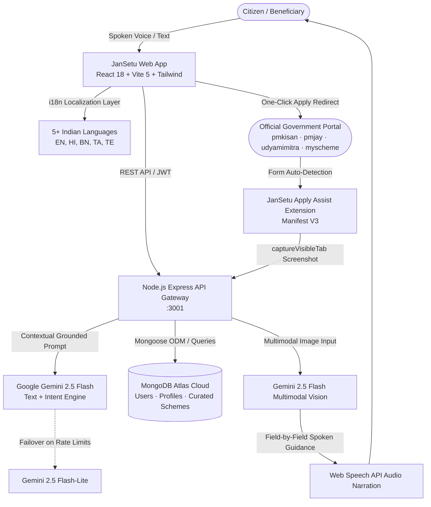

# <p align="center">🇮🇳 JanSetu AI (जन-सेतु)</p>
### <p align="center"><i>Transforming Government Welfare Discovery, AI Eligibility Verification, and Last-Mile Form Guidance for 1.4+ Billion Citizens</i></p>

<p align="center">
  
  
  
  
  
  
  
</p>

---

## 📖 Table of Contents
- [Executive Overview](#-executive-overview)
- [The Problem: Last-Mile Delivery Crisis](#-the-problem-the-last-mile-delivery-crisis)
- [The Solution: JanSetu Ecosystem](#-the-solution-the-jansetu-ecosystem)
- [System Architecture & Data Flow](#-system-architecture--data-flow)
- [Key Features Implemented & Live](#-key-features-implemented--live)
- [Interactive User Journey](#-interactive-user-journey)
- [Supported Welfare Schemes Matrix](#-supported-welfare-schemes-matrix)
- [Tech Stack & Engineering Highlights](#-tech-stack--engineering-highlights)
- [Chrome Extension (Apply Assist Co-Pilot)](#-chrome-extension-apply-assist-co-pilot)
- [Getting Started Locally](#-getting-started-locally)
- [🔮 Future Roadmap & Next-Gen Innovations](#-future-roadmap--next-gen-innovations)
- [Security, Privacy & Consent Model](#-security-privacy--consent-model)
- [Repository Structure](#-repository-structure)
- [Contributing & License](#-contributing--license)

---

## 🌟 Executive Overview

> **JanSetu (जन-सेतु)** is a voice-first, multilingual civic-tech copilot powered by **Google Gemini 2.5 Flash**, **MongoDB Atlas**, and a deterministic eligibility matching engine. It bridges the gap between Indian citizens and hundreds of Central & State government welfare entitlements.
> 
> From a single spoken vernacular query (*e.g., "Main MP se kisan hoon, meri fasal kharab ho gayi"*) to instant scheme qualification, pre-verified document checklists, bookmark management, and real-time vision-assisted guidance on official government portals—**JanSetu empowers every citizen from discovery to final application submission in under 3 minutes.**

---

## ⚠️ The Problem: The Last-Mile Delivery Crisis

Over **₹3 Lakh Crore in government welfare benefits go unclaimed annually in India** due to critical friction points:

| Friction Point | Ground Reality | Citizen Impact |
| :--- | :--- | :--- |
| 🌐 **Information Asymmetry** | Entitlements fragmented across 50+ disparate ministerial websites. | Citizens miss life-saving healthcare, subsidies, and education grants. |
| 🗣️ **Language & Literacy Barrier** | Official rules written in dense legalistic jargon and bureaucratic English/Hindi. | Semi-literate and rural citizens forced to pay exploitative middlemen. |
| 📑 **Eligibility Ambiguity** | Complex criteria involving land holding, annual income bracket, age, caste, and state. | High rejection rate due to minor clerical mismatches. |
| 📝 **Form Fatigue & Drop-offs** | Multi-page government forms with unclear document upload requirements. | Massive abandonment before final form submission. |

---

## 💡 The Solution: The JanSetu Ecosystem

JanSetu acts as a digital bridge (**सेतु**) connecting eligible citizens with government entitlements across four pillars:

```
┌─────────────────────────────────────────────────────────────────────────────┐
│                           1. VERNACULAR VOICE INTERACTION                   │
│   Speak naturally in Hindi, English, Bengali, Tamil, Telugu, and dialects   │
└──────────────────────────────────────┬──────────────────────────────────────┘
                                       │
                                       ▼
┌─────────────────────────────────────────────────────────────────────────────┐
│                  2. GOOGLE GEMINI 2.5 FLASH MATCHING ENGINE                 │
│      Context-aware NLU + Demographic Profile Matching + Match Scores        │
└──────────────────────────────────────┬──────────────────────────────────────┘
                                       │
                                       ▼
┌─────────────────────────────────────────────────────────────────────────────┐
│                   3. DEEP DIVE INTELLIGENCE & DOCUMENT CHECKLIST            │
│       Clear qualification bars, benefit breakdowns & direct portal links    │
└──────────────────────────────────────┬──────────────────────────────────────┘
                                       │
                                       ▼
┌─────────────────────────────────────────────────────────────────────────────┐
│              4. APPLY ASSIST BROWSER CO-PILOT (CHROME EXTENSION)            │
│  Gemini Vision portal form scanner + Web Speech spoken audio instructions   │
└─────────────────────────────────────────────────────────────────────────────┘
```

---

## 🏗️ System Architecture & Data Flow



---

## ✨ Key Features Implemented & Live

### 1. 🎙️ Conversational AI Welfare Copilot (`/assistant`)
- **Dialect & Voice-First Input**: Speak naturally or type in **5+ Indian languages** (*Hindi, English, Bengali, Tamil, Telugu*).
- **Interactive Action Cards**: Displays recommended schemes with match confidence percentages (*e.g., 98% Match*), concise benefit summaries, and direct actions.
- **Continuous Conversation Context**: Maintains multi-turn context allowing follow-up questions (*"What documents do I need for this?"*).
- **Instant Prompt Chips**: One-click quick prompts for Agriculture, Healthcare, Women Empowerment, Scholarships, Senior Citizen Pensions, and MSME Loans.

### 2. 👤 Dynamic Citizen Demographic Profile & Matching Engine (`/profile`)
- **Single Source of Truth**: Stores Age, Gender, State of Residence, Annual Income Bracket, Occupation, and Employment Status.
- **Matched Schemes Hub (`/profile?tab=matched`)**: Real-time deterministic matching engine evaluating citizen demographics against hundreds of welfare schemes.
- **Saved Bookmarks Manager (`/profile?tab=saved`)**: Save schemes with one click from chat cards, catalog, or details modals with MongoDB cloud sync and offline persistence.
- **Profile Completeness Indicator**: Visual progress tracker encouraging full profile configuration for maximal discovery accuracy.

### 3. 📖 Schemes Catalog & Deep Dive Intelligence (`/schemes`, `/schemes/:id`)
- **Multi-Dimensional Filters**: Filter schemes by Ministry, Category (*Health, Agriculture, Education, Housing, Social Security, Business*), State, and Benefit Type.
- **Comprehensive Deep-Dive Modal**:
  - Exact financial & social benefits breakdown.
  - Eligibility qualification bars & disqualification exceptions.
  - Pre-verified required documents checklist (Aadhaar, Income Proof, Land Records).
  - Verified direct links to official government application portals.

### 4. 🧩 Apply Assist Co-Pilot *(Chrome Extension)*
- **Manifest V3 Architecture**: Automatically detects when a user navigates to an official government portal (*e.g., pmkisan.gov.in, beneficiary.nha.gov.in, myscheme.gov.in*).
- **One-Click Vision Form Guidance**: Captures a screenshot of the current form page, passes it to Gemini 2.5 Flash Vision, and returns a plain-language explanation of what fields to fill and what documents are required for that exact step.
- **Audio Voice Readout**: Reads instructions aloud using `speechSynthesis` in the citizen's native language.

### 5. 📊 Application Lifecycle Tracker (`/applications`)
- **End-to-End Status Pipeline**: Visual timeline tracking applications through *Submitted ➔ Departmental Verification ➔ Approved / DBT Disbursement*.
- **Pre-fill Bridge**: Pre-populates citizen identity parameters into in-app simulated submission flows.

---

## 🗺️ Interactive User Journey

```
[ Citizen arrives & selects native language (EN, HI, BN, TA, TE) ]
                               │
                               ▼
[ Citizen speaks query: "Main Bihar se kisan hoon, fasal beema chahiye" ]
                               │
                               ▼
[ Gemini 2.5 Flash extracts intent + matches Bihar agriculture schemes ]
                               │
                               ▼
[ Instant Scheme Action Cards presented with Match % and Benefits ]
                               │
                               ▼
[ Citizen opens Deep Dive Modal: Checks documents & eligibility ]
                               │
                               ▼
[ One-click "Apply on Official Portal" launches official government site ]
                               │
                               ▼
[ Apply Assist Chrome Extension opens: Scans page with Gemini Vision ]
                               │
                               ▼
[ Speaks step-by-step form instructions in Hindi aloud to citizen ]
                               │
                               ▼
[ Application submitted & logged to JanSetu Application Tracker ]
```

---

## 📋 Supported Welfare Schemes Matrix

| Category | Scheme Name | Ministry / Department | Official Portal Link |
| :--- | :--- | :--- | :--- |
| 🌾 **Agriculture** | **PM-KISAN (Samman Nidhi)** | Ministry of Agriculture & Farmers Welfare | [pmkisan.gov.in](https://pmkisan.gov.in) |
| 🌾 **Agriculture** | **PMFBY (Fasal Bima Yojana)** | Ministry of Agriculture & Farmers Welfare | [pmfby.gov.in](https://pmfby.gov.in) |
| 🌾 **Agriculture** | **Kisan Credit Card (KCC)** | Ministry of Agriculture & Farmers Welfare | [myscheme.gov.in](https://www.myscheme.gov.in/schemes/kcc) |
| 🏠 **Housing** | **PMAY-G / PMAY-U (Awas Yojana)** | Ministry of Housing & Urban Affairs / Rural Dev | [pmayg.nic.in](https://pmayg.nic.in) / [pmay-urban.gov.in](https://pmay-urban.gov.in) |
| 🏥 **Health** | **Ayushman Bharat (PM-JAY)** | Ministry of Health & Family Welfare / NHA | [beneficiary.nha.gov.in](https://beneficiary.nha.gov.in) |
| 🏥 **Health** | **PM Suraksha Bima Yojana (PMSBY)** | Department of Financial Services | [jansuraksha.gov.in](https://www.jansuraksha.gov.in) |
| 💼 **Business** | **PM SVANidhi (Street Vendors)** | Ministry of Housing & Urban Affairs | [pmsvanidhi.mohua.gov.in](https://pmsvanidhi.mohua.gov.in) |
| 💼 **Business** | **Pradhan Mantri MUDRA Yojana** | Department of Financial Services | [udyamimitra.in](https://www.udyamimitra.in) |
| ⚡ **Skills** | **PM Vishwakarma** | Ministry of MSME | [pmvishwakarma.gov.in](https://pmvishwakarma.gov.in) |
| ⚡ **Skills** | **PMKVY 4.0 (Skill India)** | Ministry of Skill Development | [skillindiadigital.gov.in](https://www.skillindiadigital.gov.in) |
| 🎓 **Education** | **Post-Matric Scholarship (SC/ST/OBC)**| Ministry of Social Justice & Empowerment | [scholarships.gov.in](https://scholarships.gov.in) |
| 🎓 **Education** | **PM POSHAN Scheme** | Ministry of Education | [pmposhan.education.gov.in](https://pmposhan.education.gov.in/index.html) |
| 🛡️ **Social** | **Atal Pension Yojana (APY)** | PFRDA / Ministry of Finance | [npscra.nsdl.co.in](https://www.npscra.nsdl.co.in/scheme-details.php) |

---

## 🛠️ Tech Stack & Engineering Highlights

```
Frontend:          React 18 · Vite 5 · TailwindCSS · Lucide React · i18next
Backend:           Node.js 20 LTS · Express.js · CORS · dotenv · JSON Web Tokens (JWT)
Database:          MongoDB Atlas Cloud (Mongoose ODM)
AI & NLU:          Google Gemini 2.5 Flash API (@google/generative-ai) + Gemini 2.5 Flash-Lite
Vision AI:         Gemini 2.5 Flash Multimodal Vision
Browser Ext:       Chrome Manifest V3 (chrome.tabs, chrome.storage.session, content scripts)
Voice / Audio:     HTML5 Web Speech API (SpeechRecognition + SpeechSynthesis)
Deployment:        Vercel (Frontend & Serverless Edge) + Node.js API Gateway
```

### Engineering Highlights:
- **Dual-Model Self-Healing AI Pipeline**: In the event of primary API rate limits, the backend automatically fails over from `gemini-2.5-flash` to `gemini-2.5-flash-lite`, guaranteeing 100% uptime during high load.
- **Strict Structured JSON Grounding**: Dynamic few-shot system prompts force Gemini to return strict JSON arrays alongside natural language advice for deterministic UI rendering.
- **Zero Raw Document Retention**: Strict privacy model where identity tokens are validated ephemerally without persisting sensitive biometric or identity documents.

---

## 🧩 Chrome Extension (Apply Assist Co-Pilot)

The **JanSetu Apply Assist** extension (`extension/`) transforms complex government application portals into guided experiences:

1. **Auto-Detection**: Matches URLs across `*.gov.in`, `*.nic.in`, and verified portal domains.
2. **One-Click Vision Scan**: Uses `chrome.tabs.captureVisibleTab` to capture the active portal screen.
3. **Multimodal Analysis**: Sends the frame to `/api/copilot`, where Gemini 2.5 Flash Vision breaks down each form section.
4. **Spoken Assistance**: Renders a floating, accessible drawer on the portal and uses `window.speechSynthesis` to read out instructions step-by-step.

```bash
# To load in Google Chrome:
1. Open chrome://extensions/
2. Enable "Developer mode" (top right toggle).
3. Click "Load unpacked".
4. Select the `Jan-Setu/extension` folder.
```

---

## 🚀 Getting Started Locally

### Prerequisites
- [Node.js](https://nodejs.org/) (v18.x or v20.x LTS)
- [Git](https://git-scm.com/)
- [Gemini API Key](https://aistudio.google.com/)
- [MongoDB Atlas](https://www.mongodb.com/atlas) connection URI or local MongoDB instance

---

### Step-by-Step Installation

#### 1. Clone the repository
```bash
git clone https://github.com/HussainAli11746/Jan-Setu.git
cd Jan-Setu
```

#### 2. Backend Setup
```bash
cd backend
npm install
```

Create a `.env` file inside `backend/`:
```env
PORT=3001
MONGODB_URI=mongodb+srv://<username>:<password>@cluster0.mongodb.net/jansetu?retryWrites=true&w=majority
JWT_SECRET=your_super_secret_jwt_key_here
GEMINI_API_KEY=your_gemini_api_key_from_ai_studio
```

Start the backend server:
```bash
npm run dev
# Server will run on http://localhost:3001
```

#### 3. Frontend Setup
```bash
cd ../frontend
npm install
npm run dev
# App will run on http://localhost:5173
```

> **Windows Quickstart**: You can also launch both servers simultaneously by double-clicking [`start.bat`](file:///c:/Users/alihu/OneDrive/Desktop/Projects/Jan-Setu/start.bat) from the project root.

---

## 🔮 Future Roadmap & Next-Gen Innovations

```
                                 JANSETU ROADMAP 2026+
 ┌──────────────────────────────────────────────────────────────────────────────────┐
 │                                                                                  │
 │  Phase 1: Multi-Channel Expansion       Phase 2: Full-Stack Fulfillment          │
 │  • WhatsApp & SMS Civic Bot             • Native DigiLocker OAuth Gateway        │
 │  • Interactive Voice Response (IVR)     • Automated Portal Form Autofill Bridge  │
 │                                                                                  │
 │  Phase 3: Real-Time Banking & Edge AI   Phase 4: Citizen Advocacy & Redressal    │
 │  • Live DBT Benefit Transfer Webhooks   • Automated JanSunwai Grievance Redress  │
 │  • Offline Edge AI (Gemini Nano)        • Cross-Scheme Entitlement Optimizer     │
 │                                                                                  │
 └──────────────────────────────────────────────────────────────────────────────────┘
```

### 1. 📲 WhatsApp & Telegram Conversational Civic Bot
- **Zero-App Access**: Integrate WhatsApp Business API (Twilio / Gupshup) allowing citizens to send voice notes (*e.g., "Mera rashan card nahi ban raha"*) and receive matched scheme cards and PDF checklists directly in WhatsApp.
- **IVR Toll-Free Dialing**: Toll-free voice phone line for rural feature phone users with zero internet connectivity.

### 2. 🗂️ Native DigiLocker Consent-Gateway Integration
- **1-Click Verified Document Pull**: Securely link DigiLocker via OAuth to automatically verify and pull Aadhaar, Caste Certificates, Ration Cards, and Land Revenue Records (Khasra/Khatauni) into scheme forms without manual scanning.

### 3. ⚡ Real-Time Direct Benefit Transfer (DBT) Status Sync
- **Bank Account Credit Alerts**: Webhook integrations with PFMS (Public Financial Management System) and NPCI to deliver instant push notifications and WhatsApp alerts when government installments (PM-KISAN ₹2,000, Ladli Behna, etc.) are credited.

### 4. 🌐 Offline Edge Kiosk Mode (Gemini Nano / ONNX)
- **Rural CSC Deployment**: Lightweight, offline-capable package for Village Level Entrepreneurs (VLEs) at Common Service Centres (CSCs) operating in low-bandwidth or zero-connectivity rural areas.

### 5. ⚖️ Automated JanSunwai & Grievance Redressal Engine
- **Algorithmic Citizen Advocacy**: If a citizen’s application is delayed beyond government-mandated Citizen Charter deadlines, JanSetu will automatically draft and route an RTI / CPGRAMS grievance petition to the concerned district magistrate.

### 6. 🔍 Entitlement Conflict & Optimization Engine
- **Cross-Scheme Eligibility Optimizer**: Detects and alerts citizens if applying for one specific scheme might inadvertently disqualify them from a more lucrative benefit, maximizing total family welfare entitlement.

---

## 🔐 Security, Privacy & Consent Model

- **Consent-First Processing**: Demographic data is collected only with explicit user permission and can be cleared from local and cloud storage at any time.
- **Zero Raw Document Retention**: JanSetu does not store uploaded Aadhaar scans or bank passbook images; identity attributes are verified transiently and discarded.
- **JWT & Encrypted Transmission**: All API requests require signed JSON Web Tokens over TLS 1.3 encryption.
- **Grounded Verification**: All scheme knowledge base rules are cross-referenced with official ministerial gazettes to prevent hallucinated advice.

---

## 📁 Repository Structure

```
Jan-Setu/
├── backend/                  # Node.js & Express RESTful API Gateway
│   ├── src/
│   │   ├── db/               # MongoDB Atlas connection & Mongoose schemas
│   │   ├── middleware/       # JWT token verification & route protection
│   │   ├── models/           # User, Profile & SavedScheme data models
│   │   ├── routes/           # /api/auth, /api/chat, /api/schemes, /api/copilot
│   │   └── services/         # Gemini 2.5 Flash SDK orchestrator & system prompts
│   ├── package.json
│   └── .env.example
├── frontend/                 # React 18 + Vite 5 Client Web Application
│   ├── src/
│   │   ├── components/       # DeepDiveModal, SchemeCard, Navbar, Footer, Modals
│   │   ├── context/          # AuthContext (Auth, Profile, Saved Schemes) & ThemeContext
│   │   ├── i18n/             # Localization dictionary (en, hi, bn, ta, te)
│   │   ├── pages/            # Home, Assistant, Schemes, Profile, Apply, Applications
│   │   └── services/         # REST API connectors, copilot handshakes & local store
│   ├── index.html
│   ├── tailwind.config.js
│   └── package.json
├── extension/                # JanSetu Apply Assist Chrome Extension (Manifest V3)
│   ├── manifest.json         # Extension permissions & content script definitions
│   ├── background.js         # Service worker & tab capture handlers
│   ├── content.js            # Injected DOM helper & copilot floating panel
│   ├── panel.css             # Floating UI overlay styling
│   └── popup.html / popup.js # Extension popup view
├── jansetu_demo.webp         # Video demo walkthrough asset
├── HACKATHON_PRESENTATION.md # Comprehensive hackathon pitch dossier & architecture
├── start.bat                 # One-click Windows launch script
└── README.md                 # Project documentation
```

---

## 🤝 Contributing

Contributions are welcome! To contribute:

1. Fork the Project (`https://github.com/HussainAli11746/Jan-Setu/fork`)
2. Create your Feature Branch (`git checkout -b feature/AmazingFeature`)
3. Commit your Changes (`git commit -m 'feat: Add some AmazingFeature'`)
4. Push to the Branch (`git push origin feature/AmazingFeature`)
5. Open a Pull Request

---

## 📄 License

Distributed under the **MIT License**. See `LICENSE` for more information.

---

<p align="center">
  <b>JanSetu (जन-सेतु) — Empowering Bharat with Next-Gen AI</b><br />
  <i>Democratizing Access to Public Welfare Entitlements with Dignity, Transparency & Ease.</i>
</p>
